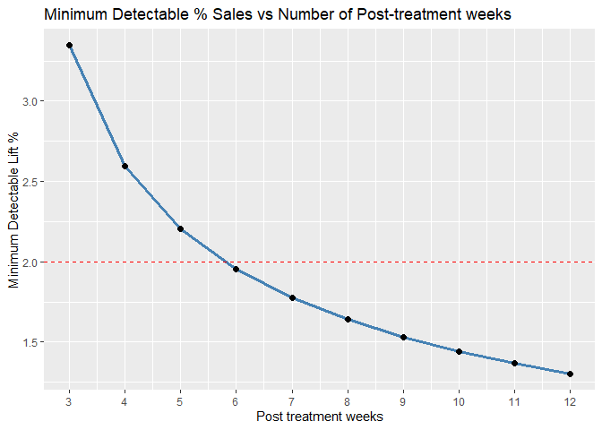

Experiment Design: Marketing Campaign Regional Effect
================
Johnathan Lin
2025-06-20

``` r
library(tidyverse)
library(lmtest)
library(sandwich)
library(ggplot2)
library(pwr)
```

The goal of this exercise is to simulate a scenario in which a marketing
campaign is run in one region (NYC) while another region (Boston) serves
as the control group.By constructiing a synthetic dataset we can mirror
the type of real world conditions that real world experiments are under.
Using this controlled setup allows us to explore the core concepts of
experimental design, specifically how to identify and measure the causal
effect of campaigns on outcomes like sales.Key Factors to consider
include the treatment effect, sample size, significance level, and power
of the test.

``` r
set.seed(42)
```

# Simulate dataset with two region with 24 weeks, 18 weeks of pretreatment and 6 weeks of post-treatment data.

``` r
weeks <- 24
n_regions <- 2
regions <- c("NYC", "Boston")
treatment_week <- 19
```

``` r
df <- expand.grid(week = 1:weeks, region = regions)
df <- df %>% 
  mutate(treated = ifelse(region == "NYC", 1, 0),
         post = ifelse(week >= treatment_week, 1,0),
         
         did = treated * post,
         base_sales = 100 +rnorm(n(), 5) # base sales : 100
         )
```

``` r
df <- df %>% 
  mutate(treatment_effect = ifelse(did == 1, 20, 0),
         sales = base_sales + treatment_effect
         )
```

``` r
# baseline sales in NYC before treatment
baseline_nyc <- df %>% 
  filter(region == "NYC", week < treatment_week) %>% 
  summarize(mean_sales = mean(sales)) %>% 
  pull(mean_sales)

baseline_nyc
```

    ## [1] 105.2755

``` r
true_lift_pct <- (20/baseline_nyc) * 100
true_lift_pct
```

    ## [1] 18.99777

The true effect of the lift from the campaign is about 19% in NYC.

``` r
ggplot(df, aes (x= week, y = sales, color =region, group = region)) +
  geom_line(size = 1.2) + 
  geom_vline(xintercept = treatment_week, linetype = "dashed", color = 'black') +
  labs( title = "Weekly Sales by Region", subtitle = "Dashed Line: Treatment Starts in NYC", y = "Sales", x = "Week") +
  scale_x_continuous(breaks = seq(min(df$week), max(df$week), by = 1)) 
```

<!-- -->

``` r
baseline_nyc <- df %>% 
  filter(region == "NYC", week < treatment_week) %>% 
  summarize(mean_sales = mean(sales)) %>% 
  pull(mean_sales)

baseline_nyc
```

    ## [1] 105.2755

``` r
# assuming mde of 2%
effect_units <- 0.02 * baseline_nyc
effect_units
```

    ## [1] 2.10551

``` r
sd_sales = df %>% 
  filter(week < treatment_week) %>% 
  summarize(sd = sd(sales)) %>% 
  pull(sd)
sd_sales
```

    ## [1] 1.146854

``` r
d <- effect_units / sd_sales
d
```

    ## [1] 1.8359

``` r
# calculate power of treatment in 6 weeks
pwr.t.test(d = 1.8359 , n = 6 , sig.level = 0.05,  type = "two.sample")
```

    ## 
    ##      Two-sample t test power calculation 
    ## 
    ##               n = 6
    ##               d = 1.8359
    ##       sig.level = 0.05
    ##           power = 0.816997
    ##     alternative = two.sided
    ## 
    ## NOTE: n is number in *each* group

If there was truly a 2% lift in NYC sales due to the campaign, then
given our sample size and variability, we would detect that effect with
81.6% probability.

There is only 18.4% chance that I’d miss a true effect of that size
(Type II error).

``` r
d = pwr.t.test( n = 6 , sig.level = 0.05, power =0.8,  type = "two.sample")$d
pwr.t.test( n = 6 , sig.level = 0.05, power =0.8,  type = "two.sample")
```

    ## 
    ##      Two-sample t test power calculation 
    ## 
    ##               n = 6
    ##               d = 1.795541
    ##       sig.level = 0.05
    ##           power = 0.8
    ##     alternative = two.sided
    ## 
    ## NOTE: n is number in *each* group

``` r
sd_pre <- df %>% 
  filter(week < treatment_week) %>% 
  summarize(sd_sales = sd(sales)) %>% 
  pull(sd_sales)
  
baseline_nyc <- df %>%
  filter(region == "NYC", week < treatment_week) %>%
  summarize(mean_sales = mean(sales)) %>%
  pull(mean_sales)
```

``` r
mde_units <- d * sd_pre
mde_units
```

    ## [1] 2.059224

``` r
mde_pct <- (mde_units/baseline_nyc) *100
mde_pct
```

    ## [1] 1.956034

Given 6 weeks to test the marketing campaign, with the desired
significance level and power, the minimum detectable change is 2.06
units or a lift percent of 1.95%

If we wanted to detect at least a 2% lift, our current testing set up
would allow for that since we can detect minimum detectable change as
small as 1.95%.

# How MDE changes given sample size n?

How does the length of the campaign affect our ability to measure its
true impact? As we design the experiements, one consideration is how
long we should run the campaign to obtain reliable results. General
intuition says more data is better, but how much more data is needed to
detect a small effect size?

``` r
weeks_range <- 3:12

compute_mde <- function(n_weeks, sd, baseline){
  d_mde <- pwr.t.test( n = n_weeks , sig.level = 0.05, power =0.8,  type = "two.sample", alternative = "two.sided")$d
  mde_units <- d_mde * sd
  mde_pct <- (mde_units/baseline) * 100
  return(data.frame(weeks = n_weeks,
                    d = d_mde,
                    mde_units,
                    mde_pct
                    ))
}
```

``` r
baseline_nyc <- df %>%
  filter(region == "NYC", week < treatment_week) %>%
  summarize(mean_sales = mean(sales)) %>%
  pull(mean_sales)
```

``` r
mde_table <- lapply(weeks_range, compute_mde, sd = sd_pre, baseline = baseline_nyc) %>% 
  bind_rows()
```

``` r
knitr::kable(round(mde_table, 2), caption = "Minimum Detectable Effect by Week")
```

| weeks |    d | mde_units | mde_pct |
|------:|-----:|----------:|--------:|
|     3 | 3.07 |      3.52 |    3.35 |
|     4 | 2.38 |      2.73 |    2.59 |
|     5 | 2.02 |      2.32 |    2.21 |
|     6 | 1.80 |      2.06 |    1.96 |
|     7 | 1.63 |      1.87 |    1.78 |
|     8 | 1.51 |      1.73 |    1.64 |
|     9 | 1.41 |      1.61 |    1.53 |
|    10 | 1.32 |      1.52 |    1.44 |
|    11 | 1.26 |      1.44 |    1.37 |
|    12 | 1.20 |      1.37 |    1.30 |

Minimum Detectable Effect by Week

``` r
ggplot(mde_table, aes( x= weeks, y= mde_pct)) + 
  geom_line(size = 1.2, color = "steelblue") + 
  geom_point( size = 2) + 
  geom_hline(yintercept =  2, linetype = "dashed", color = "red" ) + 
  labs(title = "Minimum Detectable % Sales vs Number of Post-treatment weeks",
       x = "Post treatment weeks",
       y = "Minimum Detectable Lift %") + 
  scale_x_continuous(breaks = weeks_range)  
```

<!-- -->

The more weeks we allow the marketing campaign to run for the smaller
the minimum detectable effect size becomes. This is important to
consider if we do not expect the marketing campaign to make a large
impact on sales but we still want to measure the impact of the campaign.

# Significance Levels

At the current significance level of 0.05 and power of 0.8, we can
detect a minimum lift of 0.91% in sales with 80% power after 12 weeks of
treatment.

Suppose the implications of making the wrong decision are severe, we
might want to lower the significance level to account for that.

``` r
pwr.t.test(d = 1.924106 , sig.level = 0.05
           , power = 0.8, type = "two.sample", alternative = "two.sided")$n
```

    ## [1] 5.392737

``` r
d <- 2.099254 / 1.091028
alpha_levels <- seq(.05 , .01, by = -.01)

weeks_required <- data.frame(alpha = alpha_levels, n_required = sapply(alpha_levels, function(a) {
  ceiling(pwr.t.test(d = d, sig.level = a, power = 0.8, type = "two.sample")$n)
}))
weeks_required
```

    ##   alpha n_required
    ## 1  0.05          6
    ## 2  0.04          6
    ## 3  0.03          7
    ## 4  0.02          7
    ## 5  0.01          9

``` r
ggplot(weeks_required, aes(x = alpha, y = n_required)) +
  geom_line(size = 1.2, color = "Red") +
  geom_point(size = 2) + 
  scale_x_reverse(breaks = alpha_levels) +
  labs(title ="Weeks required for 2% lift with 80% power",
       x = "Significance Level (alpha)",
       y = "Treatment Weeks Required") +
  theme_minimal()
```

<!-- -->

If the cost of the marketing campaign is high, we might want to run the
campaign for longer to account for a more stringent alpha level to avoid
false positives as the cost of a false positive is high. There would
also need to be a balance while testing since the cost of the test
itself by running longer might by high.

# Estimating Uncertainty in Treatment Effect

``` r
weeks_range <- 3:12

estimate_ci <- function(n_weeks){
  df_subset <- df %>% 
    filter(week < treatment_week |week < (treatment_week + n_weeks))
  
  model <- lm(sales~ treated + post + did, data = df_subset)
  conf_int <- confint(model)["did",]
  est<- coef(model)["did"]
  
  return(data.frame(
    weeks = n_weeks,
    estimate = est,
    lower_ci = conf_int[1],
    upper_ci = conf_int[2]
  ))

}
```

``` r
ci_table <- do.call(rbind, lapply(weeks_range, estimate_ci))
ci_table <- ci_table %>% 
  mutate(
    estimate_pct = estimate/ baseline_nyc * 100,
    lower_ci_pct = lower_ci / baseline_nyc * 100,
    upper_ci_pct = upper_ci / baseline_nyc * 100
  )
ci_table
```

    ##      weeks estimate lower_ci upper_ci estimate_pct lower_ci_pct upper_ci_pct
    ## did      3 19.44281 17.33379 21.55182     18.46850     16.46517     20.47183
    ## did1     4 18.89679 17.04609 20.74749     17.94985     16.19189     19.70781
    ## did2     5 19.13990 17.48175 20.79805     18.18078     16.60571     19.75584
    ## did3     6 19.15716 17.57366 20.74065     18.19717     16.69302     19.70131
    ## did4     7 19.15716 17.57366 20.74065     18.19717     16.69302     19.70131
    ## did5     8 19.15716 17.57366 20.74065     18.19717     16.69302     19.70131
    ## did6     9 19.15716 17.57366 20.74065     18.19717     16.69302     19.70131
    ## did7    10 19.15716 17.57366 20.74065     18.19717     16.69302     19.70131
    ## did8    11 19.15716 17.57366 20.74065     18.19717     16.69302     19.70131
    ## did9    12 19.15716 17.57366 20.74065     18.19717     16.69302     19.70131

``` r
ggplot(ci_table, aes(x = weeks, y = estimate_pct )) + 
  geom_line(color = "steelblue", size = 1.2)+
  geom_point(size = 2)+
  geom_errorbar(aes(y = estimate_pct, ymin = lower_ci_pct, ymax = upper_ci_pct), alpha = 1,
                color = "steelblue", width = 0.3, size =1) +
 
  labs(title = "Estimated Treatment Effect with Confidence Intervals",
       x = "Post-treatment Weeks",
       y = "Estimated % Lift in Sales",
  ) +
  scale_x_continuous(breaks = weeks_range)  +
  scale_y_continuous(limits = c(17, NA), breaks = seq(17,22, by = 0.5)) +
  theme_minimal()
```


The more weeks we allow the marketing campaign to run for, the more
precise our estimates become. The confidence intervals narrow as we
gather more data, allowing us to make more reliable conclusions about
the treatment effect.By week 6 we’ve narrowed down the confidence
interval to a relatively stable range where we can be more confident
about the treatment effect to be around 17.8% to 20.3%. We can also see
that the estimated treatment effect stabilizes around 19% as we gather
more data which is consistent with the true treatment effect of 19% we
set in the simulation.

Based on the confidence intervals we can be fairly confident that the
treatment effect has a positive impact on sales in NYC. The confidence
intervals do not cross zero, indicating that we can reject the null
hypothesis of no effect with a high degree of certainty.

- Due to the nature of the dataset being simulated, the confidence
  intervals are relatively narrow and the estimates are close to the
  true treatment effect. In real world scenarios, the confidence
  intervals may be wider and the estimates may be further from the true
  treatment effect due to noise in the data and other confounding
  factors.
