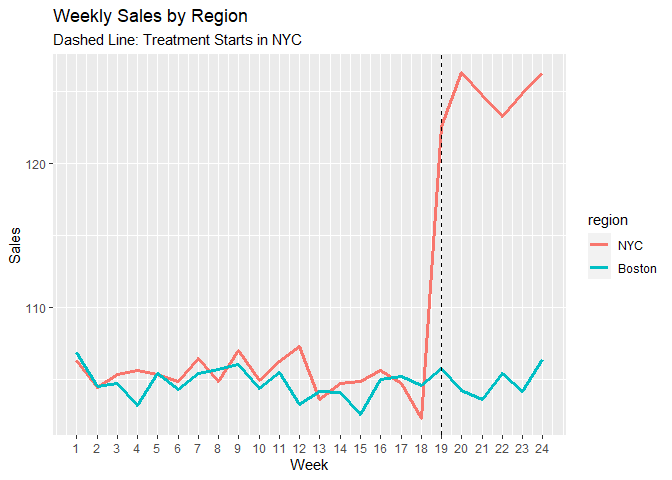
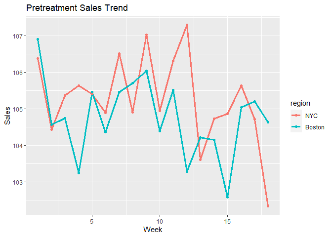

Marketing Campaign DiD Analysis
================
Johnathan Lin
2025-06-20

``` r
library(tidyverse)
library(lmtest)
library(sandwich)
library(ggplot2)
```

``` r
set.seed(42)
```

``` r
weeks <- 24
n_regions <- 2
regions <- c("NYC", "Boston")
treatment_week <- 19
```

``` r
df <- expand.grid(week = 1:weeks, region = regions)
df <- df %>% 
  mutate(treated = ifelse(region == "NYC", 1, 0),
         post = ifelse(week >= treatment_week, 1,0),
         
         did = treated * post,
         base_sales = 100 +rnorm(n(), 5) # base sales : 100
         )
```

``` r
df <- df %>% 
  mutate(treatment_effect = ifelse(did == 1, 20, 0),
         sales = base_sales + treatment_effect
         )
head(df)
```

    ##   week region treated post did base_sales treatment_effect    sales
    ## 1    1    NYC       1    0   0   106.3710                0 106.3710
    ## 2    2    NYC       1    0   0   104.4353                0 104.4353
    ## 3    3    NYC       1    0   0   105.3631                0 105.3631
    ## 4    4    NYC       1    0   0   105.6329                0 105.6329
    ## 5    5    NYC       1    0   0   105.4043                0 105.4043
    ## 6    6    NYC       1    0   0   104.8939                0 104.8939

``` r
ggplot(df, aes (x= week, y = sales, color =region, group = region)) +
  geom_line(size = 1.2) + 
  geom_vline(xintercept = treatment_week, linetype = "dashed", color = 'black') +
  labs( title = "Weekly Sales by Region", subtitle = "Dashed Line: Treatment Starts in NYC", y = "Sales", x = "Week") +
  scale_x_continuous(breaks = seq(min(df$week), max(df$week), by = 1)) 
```

<!-- -->

# Checking Parallel Trends Assumption

``` r
df <- df %>% 
  mutate(lead1 = ifelse( region =="NYC" & week == treatment_week -1,1,0),
         lead2 = ifelse(region =="NYC" & week ==treatment_week -2,1,0)
         )
```

``` r
lead_did_model <- lm(sales ~ treated + post + did + lead1 + lead2, data = df)
```

``` r
coeftest(lead_did_model, vcov = vcovHC(lead_did_model, type = "HC1"))
```

    ## 
    ## t test of coefficients:
    ## 
    ##              Estimate Std. Error  t value  Pr(>|t|)    
    ## (Intercept) 104.74835    0.25973 403.2967 < 2.2e-16 ***
    ## treated       0.74537    0.36504   2.0419   0.04747 *  
    ## post          0.20643    0.50455   0.4091   0.68451    
    ## did          18.93893    0.83153  22.7760 < 2.2e-16 ***
    ## lead1        -3.15017    0.25650 -12.2814 1.729e-15 ***
    ## lead2        -0.77797    0.25650  -3.0330   0.00414 ** 
    ## ---
    ## Signif. codes:  0 '***' 0.001 '**' 0.01 '*' 0.05 '.' 0.1 ' ' 1

The results of this test estimates that the marketing campaign resulted
in a lift of about 18.9. The lead dummy variables for the two weeks
prior to the treatment week are statistically significant, violating the
required assumptions for DiD of parallel trends. We will need to
investigate further to ensure the parallel trends assumption holds.

## Visual Inspection of Sales by Region

``` r
ggplot(df %>% 
         filter(week < treatment_week),
       aes(x = week, y = sales, color = region)) +
  geom_line(size = 1.2)+
  geom_point(size = 1.5) +
  labs(title = "Pretreatment Sales Trend",
       x = "Week", y = "Sales") 
```

<!-- -->

## Check pre-treatment period

``` r
df_pre <- df %>% 
  filter(week < treatment_week)
```

``` r
pretrend_model <- lm(sales~ week*treated , data = df_pre)
summary(pretrend_model)
```

    ## 
    ## Call:
    ## lm(formula = sales ~ week * treated, data = df_pre)
    ## 
    ## Residuals:
    ##     Min      1Q  Median      3Q     Max 
    ## -2.2453 -0.5180 -0.1388  0.8515  2.2131 
    ## 
    ## Coefficients:
    ##               Estimate Std. Error t value Pr(>|t|)    
    ## (Intercept)  105.31769    0.54032 194.916   <2e-16 ***
    ## week          -0.05993    0.04992  -1.201    0.239    
    ## treated        0.72519    0.76413   0.949    0.350    
    ## week:treated  -0.02085    0.07059  -0.295    0.770    
    ## ---
    ## Signif. codes:  0 '***' 0.001 '**' 0.01 '*' 0.05 '.' 0.1 ' ' 1
    ## 
    ## Residual standard error: 1.099 on 32 degrees of freedom
    ## Multiple R-squared:  0.1608, Adjusted R-squared:  0.08213 
    ## F-statistic: 2.044 on 3 and 32 DF,  p-value: 0.1274

Since the interaction effect of week and treated is not statistically
significant, this suggests that the pre-treatment trends are parallel
between the two regions, which satisfies the parallel trend requirement
for DiD.

The lead dummy variables tests for differences in the 2 weeks
pre-treatment while the pre-treatment interaction model tests for
differences in the entire pre-treatment period. Given that the two lead
dummies only captures the time specific fluctuations vs what the
interaction model captures which is the entire pre-treatment period, the
pre-treatment interaction model provides a more comprehensive check in
this case due to being able to generalize the entire pre-treatment
timeframe.

Alternative version of the lead dummy test we could run is with more
leads or grouped periods. However, the current model is sufficient to
show that the parallel trends assumption holds.

``` r
did_model <- lm(sales ~ treated + post + did, data = df)
ct <- coeftest(did_model, vcov = vcovHC(did_model, type = "HC1"))
ct
```

    ## 
    ## t test of coefficients:
    ## 
    ##              Estimate Std. Error  t value Pr(>|t|)    
    ## (Intercept) 104.74835    0.25376 412.7873   <2e-16 ***
    ## treated       0.52714    0.38286   1.3769   0.1755    
    ## post          0.20643    0.49295   0.4188   0.6774    
    ## did          19.15716    0.82426  23.2418   <2e-16 ***
    ## ---
    ## Signif. codes:  0 '***' 0.001 '**' 0.01 '*' 0.05 '.' 0.1 ' ' 1

``` r
confint(ct)
```

    ##                   2.5 %     97.5 %
    ## (Intercept) 104.2369328 105.259767
    ## treated      -0.2444578   1.298731
    ## post         -0.7870382   1.199907
    ## did          17.4959781  20.818333

The campaign led to an increase in weekly sales of ~ 19.16 in NYC
compared to the control group Boston. The effect is statistically
significant with a tight confidence interval suggesting high confidence
in the measured impact of the marketing campaign produced a positive
impact on sales.

# Conclusion

The pre-period interaction model suggests no difference in trends
between regions, satisfying the parallel trends assumption. While the
lead dummies showed siginifcant level differences in the 2 weeks
pre-treatment, this may be a reflection of the time specific noise. The
campaign had a positive impact on sales in the NYC region compared to
Boston. We can conclude that the marketing campaign had a positive
impact on sales on average of 19.16 per week with a 95% confidence
interval of (17.49, 20.81). Over the 6 weeks of the campaign, this
translates to an average increase of 114.96 in incremental sales.

# Next steps

We can take this further but using the marketing spend per week to
calculate whether or not the average lift of 19.16 produces a positive
ROI. We can also evaluate the range of potential ROI by using the lower
and upper bounds of the 95% confidence interval. This helps us
understand the potential range of ROI we can expect from the campaign.
